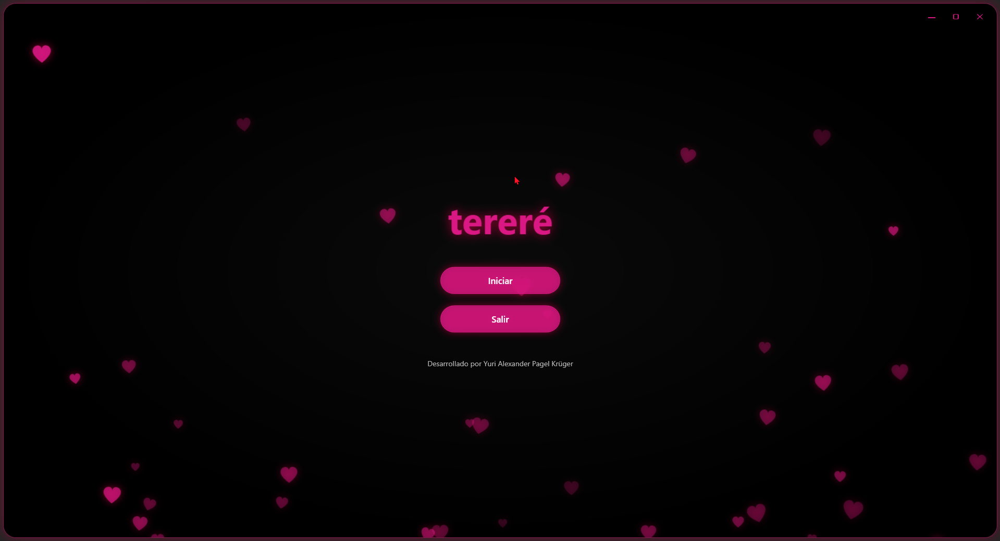
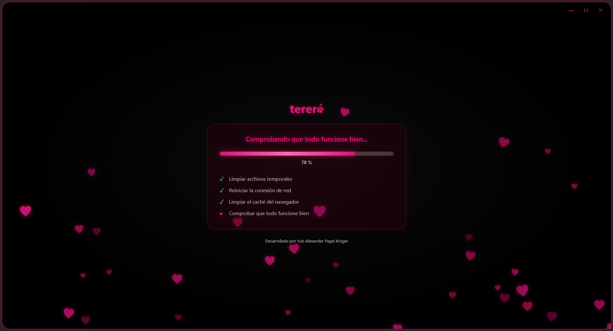

# tereré

**tereré** es una herramienta de optimización y limpieza para Windows escrita en C# con WPF. Diseñada para técnicos, usuarios domésticos y cualquiera que busque dejar su PC como nueva con un solo clic, *tereré* reemplaza comandos manuales de consola por una experiencia visual moderna, estética y automatizada.

Con un flujo directo y guiado, la aplicación limpia archivos temporales, vacía la papelera de reciclaje, reinicia la pila de red, vacía el caché DNS y verifica la integridad del sistema—todo desde una única interfaz oscura con detalles rosas, sin abrir jamás una ventana de consola.

## 📸 Capturas de pantalla

## ✨ Características principales

* **Limpieza profunda de archivos temporales:** Elimina automáticamente los archivos de `%Temp%` y `C:\Windows\Temp`, omitiendo silenciosamente los que estén en uso.

* **Vaciado de papelera de reciclaje:** Invoca la API nativa del Shell (`SHEmptyRecycleBin`) para vaciar la papelera sin confirmaciones ni ventanas emergentes.

* **Reparación de red completa:** Ejecuta `netsh winsock reset`, `ipconfig /flushdns` y `sfc /scannow` en segundo plano, en orden y esperando la finalización de cada uno.

* **Ejecución invisible de comandos:** Todo el trabajo sucio se hace a través de `cmd.exe` oculto (`CreateNoWindow`, `WindowStyle.Hidden`), sin que el usuario vea jamás una consola negra.

* **Elevación UAC integrada:** Manifiesto de ejecución que solicita permisos de Administrador automáticamente al abrir la app.

* **Carrusel de progreso visual:** Barra de progreso rosa animada con porcentaje, texto de estado dinámico y checklist de pasos con tildes verdes al completarse.

* **Diseño estético con transparencias:** Ventana sin bordes, fondo negro con degradado radial, transparencia real, esquinas redondeadas, borde rosa con glow y corazones rosas cayendo animados de fondo.

* **Cursor personalizado:** Puntero reemplazado por un círculo rosa brillante con halo, generado dinámicamente con WPF.

* **Memoria de estado de ventana:** Recuerda si la app estaba maximizada o en ventana normal, y su posición exacta, al cerrar y volver a abrir.

* **Adaptación a cualquier resolución:** Maximiza correctamente en 4K, Full HD, ultrawide y múltiples monitores, detectando el monitor actual y compensando el escalado DPI.

## ⚙️ ¿Qué hace? (Pasos del proceso)

Al presionar **Iniciar**, la app ejecuta en segundo plano, en este orden:

1. **Limpieza de archivos temporales:** Borra el contenido de `%Temp%` y `C:\Windows\Temp`, omitiendo los archivos bloqueados. Al terminar, vacía la papelera de reciclaje.

2. **Reinicio de la conexión de red:** Ejecuta `netsh winsock reset` para restaurar la pila de red a su estado de fábrica.

3. **Limpieza del caché DNS:** Ejecuta `ipconfig /flushdns` para eliminar el caché de resolución de nombres.

4. **Verificación del sistema:** Ejecuta `sfc /scannow` para comprobar y reparar la integridad de los archivos del sistema.

Al finalizar los 4 pasos, la app vuelve automáticamente al menú principal.

## 🛠️ Construido con

* **Lenguaje:** C# 12 / .NET 8

* **Framework de UI:** WPF (Windows Presentation Foundation)

* **APIs del sistema:** Win32 API (`SHEmptyRecycleBin`, `MonitorFromWindow`, `GetMonitorInfo`, `CreateIconIndirect`), `System.Diagnostics.Process`, `System.Runtime.InteropServices`.

* **Diseño:** XAML con animaciones (`DoubleAnimation`, `DropShadowEffect`), degradados radiales y `Canvas` dinámico para los corazones.

* **Empaquetado:** Inno Setup 7 (instalador x64 con modo oscuro nativo y elevación UAC).

* **Entorno de desarrollo:** Visual Studio Enterprise 2026.

## 🚀 Instalación y uso

1. Descargá el instalador desde la sección [**Releases**](../../releases).

2. Ejecutá `terere_v1.0.0_setup_x64.exe`.

*Nota:* La aplicación y el instalador solicitarán automáticamente privilegios de **Administrador (UAC)**, ya que las operaciones de limpieza y los comandos del sistema requieren permisos elevados.

3. Se creará un acceso directo en el Menú Inicio (y opcionalmente en el Escritorio) con el corazón rosa como ícono.

4. Abrí **tereré**, presioná **Iniciar** y dejá que la app haga su magia.

## 👨‍💻 Autor

Desarrollado por **Yuri Alexander Pagel Krüger**
